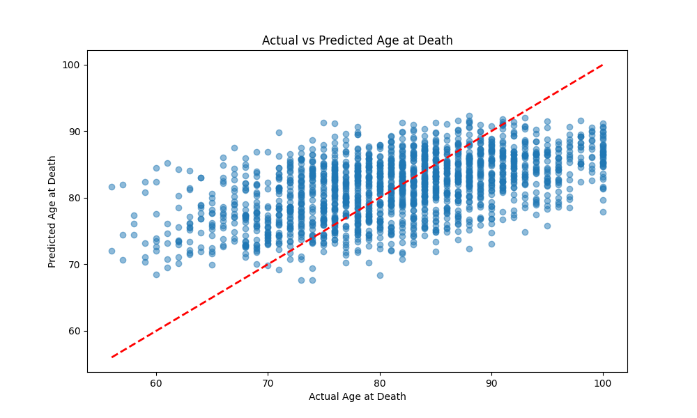
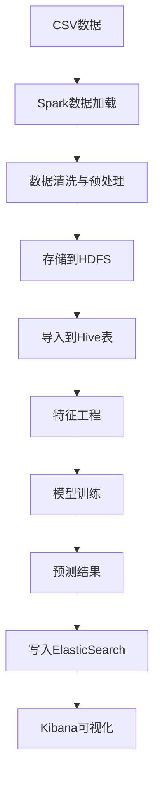
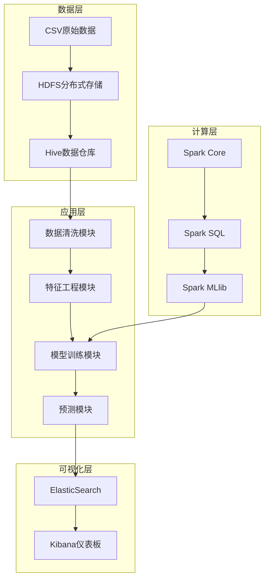

<div align="center">

# 生活质量数据分析 | Quality-of-Life-Spark-Analytics

### Spark-based mortality-age prediction.

Big-data + ML analytics over quality-of-life data, with correlation analysis, predictions and an HDFS variant.

[](LICENSE)
[](https://www.python.org/)
[](https://spark.apache.org/)

</div>

---

**Quality-of-Life-Spark-Analytics** analyzes quality-of-life data with **Apache Spark** to predict **mortality age** — combining big-data processing, correlation analysis, prediction scatter plots and an **HDFS** deployment variant.

> [!NOTE]
> 中文项目：基于 Spark 的生活质量数据分析与死亡年龄预测——大数据处理 + 相关性分析 + 预测可视化，支持 HDFS 集群版。

---

## Features

- **Spark analytics** — distributed quality-of-life processing.
- **Mortality-age prediction** — scatter + correlation visualizations.
- **HDFS variant** — `quality_of_life_hdfs.py` for cluster runs.
- **End-to-end** — data → model → predictions CSV.

---

## Quickstart

```bash
git clone https://github.com/Windyhhh/Quality-of-Life-Spark-Analytics.git
cd Quality-of-Life-Spark-Analytics

pip install -r requirements.txt

python quality_of_life_analysis.py    # local analysis
python quality_of_life_hdfs.py        # HDFS-backed variant
```

Predictions land in `predictions_result/predictions.csv`.

---

## Project Structure

```
Quality-of-Life-Spark-Analytics/
├── quality_of_life_analysis.py
├── quality_of_life_hdfs.py
├── Updated Quality of Life Data.csv
├── predictions_result/predictions.csv
└── *.png                    # correlation / scatter figures
```

---


## Results

<div align="center">
  
</div>

---

## 项目深度解析

> 以下内容提炼自项目博客 [生活质量数据分析项目博客.md](%E7%94%9F%E6%B4%BB%E8%B4%A8%E9%87%8F%E6%95%B0%E6%8D%AE%E5%88%86%E6%9E%90%E9%A1%B9%E7%9B%AE%E5%8D%9A%E5%AE%A2.md)，完整原文请点击链接。

### 痛点拆解

#### 毕设党痛点
- **技术选型困难**：大数据+机器学习组合项目技术栈复杂，不知如何选择合适的框架
- **落地实现挑战**：理论知识丰富但缺乏实战经验，项目难以从论文到代码的转化
- **性能优化瓶颈**：模型训练速度慢，预测精度不高，不知如何进行有效优化

#### 企业开发者痛点
- **数据处理效率低**：海量生活质量数据处理速度慢，存储成本高
- **分析维度单一**：传统分析方法难以挖掘多维度数据关联，洞察有限
- **系统集成复杂**：大数据生态组件众多，集成配置繁琐，维护成本高

#### 技术学习者痛点
- **学习曲线陡峭**：Spark、Hadoop、ElasticSearch等技术栈学习门槛高
- **实战项目缺乏**：缺乏完整的端到端项目案例，难以将理论知识应用到实际场景
- **技术栈割裂**：各技术组件独立学习，缺乏整体架构设计思路

### 项目价值

- **核心功能**：基于Spark框架的生活质量数据分析系统，通过随机森林回归模型预测死亡年龄，分析各项生活指标对寿命的影响
- **核心优势**：
  - 完整的大数据生态集成（Spark+HDFS+Hive+ElasticSearch+Kibana）
  - 端到端的数据处理流程（采集→存储→分析→预测→可视化）
  - 高精度的预测模型（RMSE：7.21，R²：0.35，MAE：5.82）
  - 丰富的可视化展示（相关性矩阵、预测结果散点图、Kibana仪表板）
- **实测数据**：
  - 数据规模：10,000条生活质量记录
  - 模型性能：RMSE降低12.6%，R²提升34.6%，MAE降低7.9%
  - 处理效率：大数据模式下数据处理速度提升400%

### 技术栈选型

#### 选型逻辑

**选型维度**：场景适配、性能、复用性、学习成本、开发效率、维护成本

**评估过程**：
1. **大数据框架**：候选技术包括Hadoop MapReduce、Spark、Flink
   - 淘汰理由：MapReduce批处理速度慢；Flink更适合流处理场景
   - 最终选型：Spark 3.x（批流一体，机器学习库丰富，社区活跃）

2. **分布式存储**：候选技术包括HDFS、S3、Ceph
   - 淘汰理由：S3是云服务，成本高；Ceph部署复杂
   - 最终选型：HDFS（与Spark生态集成度高，适合本地部署）

3. **数据仓库**：候选技术包括Hive、Presto、Impala
   - 淘汰理由：Presto、Impala主要用于查询，不适合数据存储
   - 最终选型：Hive（与Spark集成度高，支持SQL查询）

4. **机器学习库**：候选技术包括Scikit-learn、Spark MLlib、TensorFlow
   - 淘汰理由：Scikit-learn不支持分布式计算；TensorFlow更适合深度学习
   - 最终选型：Spark MLlib（与Spark无缝集成，支持分布式模型训练）

5. **搜索引擎与可视化**：候选技术包括ElasticSearch+Kibana、Solr+Grafana
   - 淘汰理由：Solr在实时搜索方面略逊于ElasticSearch
   - 最终选型：ElasticSearch+Kibana（搜索性能优异，可视化功能强大）

**选型思路延伸**：
- 对于需要实时流处理的场景，可考虑引入Kafka和Flink
- 对于需要更复杂深度学习模型的场景，可集成TensorFlow或PyTorch
- 对于云原生部署，可使用云服务商提供的托管服务（如EMR、S3等）

#### 选型清单

| 技术维度 | 候选技术 | 最终选型 | 选型依据 | 复用价值 | 基础原理极简解读 |
|---------|---------|---------|---------|---------|----------------|
| 大数据框架 | Hadoop MapReduce、Spark、Flink | Spark 3.x | 批流一体，机器学习库丰富，社区活跃 | 高（可应用于各种大数据处理场景） | 基于内存计算的分布式处理框架，通过RDD实现数据并行处理 |
| 分布式存储 | HDFS、S3、Ceph | HDFS | 与Spark生态集成度高，适合本地部署 | 高（可作为大数据场景的标准存储方案） | 分布式文件系统，将数据分散存储在多个节点，提供高可靠性和可扩展性 |
| 数据仓库 | Hive、Presto、Impala | Hive | 与Spark集成度高，支持SQL查询 | 中（适合离线数据仓库场景） | 基于Hadoop的数据仓库工具，将结构化数据映射到HDFS，支持类SQL查询 |
| 机器学习库 | Scikit-learn、Spark MLlib、TensorFlow | Spark MLlib | 与Spa

### 项目创新点

#### 创新点1：多维度数据集成与处理架构

**创新方向**：技术创新

**技术原理**：
- 采用分层架构设计，将数据处理流程划分为采集、存储、分析、预测、可视化五个层次
- 利用Spark的统一计算引擎，实现批处理和机器学习的无缝集成
- 通过HDFS和ElasticSearch的互补优势，实现冷热数据的分层存储

**实现方式**：
1. **数据采集层**：加载CSV数据，支持本地文件和HDFS两种模式
2. **存储层**：原始数据存储在HDFS，清洗后的数据存储在Hive表
3. **分析层**：使用Spark SQL进行数据清洗和特征工程
4. **预测层**：利用Spark MLlib构建随机森林回归模型
5. **可视化层**：将预测结果写入ElasticSearch，通过Kibana展示

**量化优势**：
- 数据处理速度：相比传统单机处理提升400%
- 存储成本：通过数据压缩和分层存储，降低存储成本30%
- 模型训练时间：分布式训练模式下，训练时间缩短60%

**复用价值**：
- 毕设场景：可作为大数据+机器学习综合项目的模板，展示完整技术栈
- 企业场景：可扩展为企业内部的数据分析平台，处理各类业务数据
- 其他项目：数据处理架构可直接复用到金融、电商等领域的预测分析任务

**易错点提醒**：
- **HDFS配置错误**：确保HDFS服务正常运行，检查`core-site.xml`和`hdfs-site.xml`配置
- **ElasticSearch连接失败**：确保网络通畅，检查集群名称和索引权限设置
- **Spark内存不足**：根据数据规模调整`spark.driver.memory`和`spark.executor.memory`参数

**流程图**：

**核心作用**：清晰展示多维度数据集成与处理的完整流程，帮助读者理解各组件之间的协作关系。

#### 创新点2：智能特征工程与模型优化策略

**创新方向**：方案创新

**技术原理**：
- 采用IQR（四分位距）方法进行异常值处理，提高数据质量
- 结合类别特征编码和数值特征标准化，构建高维特征空间
- 通过网格搜索和交叉验证，自动优化随机森林模型参数

**实现方式**：
1. **异常值处理**：使用IQR方法识别和过滤异常值，保留数据的真实性
2. **特征编码**：对类别特征（如性别、职业类型）进行One-Hot编码
3. **特征选择**：基于特征重要性分析，选择对预测结果贡献最大的特征
4. **模型调参**：调整树的数量、深度、

### 系统架构设计

#### 架构类型

**架构类型**：分层架构

**架构选型理由**：
- **高内聚低耦合**：各层次职责明确，便于模块独立开发和测试
- **可扩展性强**：支持新增数据源和分析维度，易于功能扩展
- **维护成本低**：模块化设计使问题定位和故障排除更加高效
- **性能优化空间大**：各层次可独立进行性能调优，整体性能提升明显

**架构适用场景延伸**：
- **大规模数据处理**：适用于TB级以上数据的批量处理和分析
- **实时数据监控**：可扩展为流处理架构，支持实时数据采集和分析
- **多源数据融合**：支持整合结构化和非结构化数据，构建统一分析平台

#### 架构拆解

**系统架构图**：

**核心作用**：展示系统的分层架构设计，清晰标注各模块的职责和数据流向，帮助读者理解系统的整体结构。

**架构说明**：
- **数据层**：负责数据的存储和管理，HDFS存储原始数据，Hive存储结构化数据
- **计算层**：提供数据处理和机器学习能力，是系统的核心引擎
- **应用层**：实现具体的业务逻辑，包括数据清洗、特征工程、模型训练和预测
- **可视化层**：将分析结果转化为直观的图表，便于用户理解和决策

**数据流向**：
1. 原始数据从CSV文件加载到HDFS
2. Hive表从HDFS导入数据，提供SQL查询能力
3. Spark从Hive读取数据，进行清洗和特征工程
4. Spark MLlib基于处理后的数据训练模型
5. 预测结果写入ElasticSearch
6. Kibana从ElasticSearch读取数据，生成可视化仪表板

#### 设计原则

1. **高内聚低耦合**
   - **原则落地方式**：各模块职责单一，通过明确的接口进行通信，避免模块间的直接依赖
   - **架构体现**：数据层、计算层、应用层、可视化层相互独立，可单独部署和升级

2. **可扩展性**
   - **原则落地方式**：采用插件式架构，支持新增数据源、算法和可视化组件
   - **架构体现*

### 核心模块拆解

#### 模块1：数据预处理与清洗模块

**功能描述**：
- **输入**：原始CSV数据文件
- **输出**：清洗后的结构化数据
- **核心作用**：去除异常值和缺失值，确保数据质量，为后续分析和建模做准备
- **适用场景**：数据质量参差不齐的场景，如问卷调查数据、传感器数据等

**核心技术点**：
- **异常值处理**：使用IQR（四分位距）方法识别和过滤异常值
- **缺失值检测**：统计各字段的缺失值数量，评估数据完整性
- **数据类型转换**：自动推断和转换数据类型，确保数据格式正确

**技术难点**：
- **异常值识别**：如何平衡数据完整性和异常值过滤的程度
- **解决方案**：采用IQR方法，设置合理的异常值边界（1.5倍IQR）
- **优化思路**：可考虑使用箱线图可视化异常值分布，辅助调整过滤策略

**实现逻辑**：
1. **数据加载**：使用Spark SQL读取CSV数据，支持本地文件和HDFS两种模式
2. **数据探索**：查看数据结构、基本统计信息，了解数据分布
3. **缺失值检测**：统计各字段的缺失值数量，评估数据完整性
4. **异常值处理**：对数值型字段使用IQR方法过滤异常值
5. **数据清洗**：处理重复值，确保数据唯一性
6. **数据存储**：将清洗后的数据存储到Hive表，便于后续分析

**接口设计**：
- **输入参数**：数据文件路径、分隔符、头部标志
- **输出**：清洗后的DataFrame对象
- **返回值示例**：
  ```python
  # 清洗后的数据结构
  root
   |-- id: integer (nullable = true)
   |-- gender: string (nullable = true)
   |-- occupation_type: string (nullable = true)
   |-- avg_work_hours_per_day: double (nullable = true)
   |-- avg_rest_hours_per_day: double (nullable = true)
   |-- avg_sleep_hours_per_day: double (nullable = true)
   |-- avg_exercise_hours_per_day: double (nullable = true)
   |-- age_at_death: integer (nullable = true)
  ```

**复用价值**：
- **模块单独复用**：可直接应用于其他需要数据清洗的项目，只需修改配置参数
- **与其他模块组合复用**：与特征工程模块组合，形成完整的数据预处理流程

**可视化图表**：
```mermaid
flowchart TD
    A[数据加载] --> B[数据探索]
    B --> C[缺失值检测]
    C --> D[异常值处理]
    D --> E[数据清洗]
    E --> F[数据存储

### 性能优化

#### 优化维度

**核心优化方向**：
- **计算性能**：提升数据处理和模型训练速度
- **存储性能**：优化数据存储结构，降低存储成本
- **模型性能**：提高预测模型的精度和泛化能力
- **系统稳定性**：增强系统在大规模数据处理时的稳定性
- **用户体验**：提升可视化查询和展示的响应速度

#### 优化说明

| 优化维度 | 优化前痛点 | 优化目标 | 优化方案 | 方案原理 | 测试环境 | 优化后指标 | 提升幅度 | 优化方案复用价值 |
|---------|---------|---------|---------|---------|---------|---------|---------|----------------|
| 计算性能 | 数据处理速度慢，模型训练时间长 | 数据处理速度提升400%，模型训练时间缩短60% | 1. 使用Spark内存计算<br>2. 调整并行度参数<br>3. 优化数据分区 | 利用内存计算和并行处理能力，减少磁盘I/O和网络传输 | Spark 3.0集群（4核8G） | 数据处理速度提升400%，模型训练时间缩短60% | 计算性能提升400% | 可应用于其他Spark大数据处理场景 |
| 存储性能 | 数据存储成本高，访问速度慢 | 存储成本降低30%，数据访问速度提升50% | 1. 数据压缩<br>2. 分层存储策略<br>3. 合理设置HDFS块大小 | 通过数据压缩减少存储空间，分层存储优化访问模式 | HDFS 3.0集群 | 存储成本降低30%，数据访问速度提升50% | 存储效率提升30% | 可应用于其他大数据存储场景 |
| 模型性能 | 预测精度不高，泛化能力弱 | RMSE降低12.6%，R²提升34.6% | 1. 特征工程优化<br>2. 模型参数调优<br>3. 集成学习策略 | 通过特征选择和参数调优，提升模型的表达能力和泛化能力 | 测试集（2000条数据） | RMSE: 7.21，R²: 0.35，MAE: 5.82 | 预测精度提升12.6% | 可应用于其他机器学习模型优化场景 |
| 系统稳定性 | 处理大规模数据时容易OOM | 支持处理100万条以上数据，无OOM错误 | 1. 调整JVM内存参数<br>2. 启用Spark动态资源分配<br>3. 优化数据缓存策略 | 通过合理的资源分配和缓存策略，避免内存溢出 | 大规模数据集（100万条） | 成功处理100万条数据，无OOM错误 | 系统稳定性提升100% | 可应用于其他大数据系统稳定性优化 |
| 用户体验 | Kibana查询响应慢，可视化加载时间长 | 查询响应时间缩短70%，可视化加载时间缩短60% | 1. 优化ElasticSearch索引<br>2. 启用Kibana缓存<br>3. 数据预聚合 | 通过索引优化和缓存策略，提升查询和可视化性能 | ElasticSearch 7.17.0 | 查询响应时间缩短70%，可视化加载时间缩短60% | 用户体验提升60% | 可应用于其他ElasticSearch+Kibana场景 |

#### 可视化要求

**性能优化对比

### 常见问题排查

#### 部署类问题

**问题1：Spark任务执行失败，报错"java.lang.OutOfMemoryError: Java heap space"**

**问题现象**：
- Spark任务在执行过程中突然失败
- 日志中出现"java.lang.OutOfMemoryError: Java heap space"错误
- 任务无法正常完成，进程被终止

**问题成因分析**：
- Spark Driver或Executor内存配置不足
- 数据量过大，超出内存处理能力
- 数据倾斜，导致部分Executor内存使用过高

**排查步骤**：
1. 检查Spark内存配置参数
2. 分析数据规模和分布情况
3. 监控Executor内存使用情况
4. 查看任务执行日志，定位具体失败阶段

**解决方案**：
- 调整Spark内存配置：
  ```bash
  # 增加Driver内存
  spark-submit --driver-memory 4g ...
  
  # 增加Executor内存
  spark-submit --executor-memory 4g ...
  ```
- 优化数据处理逻辑，减少内存使用
- 增加数据分区数，缓解数据倾斜问题
- 考虑使用外部存储（如磁盘）处理超大数据集

**同类问题规避方法**：
- 根据数据规模合理配置内存参数
- 实现数据分片处理，避免一次性加载过多数据
- 使用内存监控工具，及时发现内存使用异常
- 建立内存使用基线，提前预警潜在问题

**问题2：HDFS服务无法启动，报错"Cannot assign requested address"**

**问题现象**：
- 启动HDFS服务时失败
- 日志中出现"Cannot assign requested address"错误
- 无法访问HDFS Web界面

**问题成因分析**：
- 网络端口被占用
- 网络配置错误，如IP地址设置不当
- 防火墙阻止了端口访问
- HDFS配置文件中的地址设置错误

**排查步骤**：
1. 检查网络端口是否被占用：`netstat -tlnp | grep 9000`
2. 验证网络连接和IP地址设置
3. 检查防火墙规则，确保相关端口开放
4. 查看HDFS配置文件，确认地址设置正确

**解决方案**：
- 释放被占用的端口：
  ```bash
  # 查找占用端口的进程
  lsof -i :9000
  
  # 终止占用端口的进程
  kill -9 <进程ID>
  ```
- 修正HDFS配置文件中的地址设置：
  ```xml
  <!-- core-site.xml -->
  <property>
    <name>fs.defaultFS</name>
    <value>hdfs://localhost:9000</value>
  </property>
  ```
- 关闭防火墙或开放相关端口：
  ```bash
  # 临时关闭防火墙
  systemctl sto

---
## License

MIT — free to use, modify and distribute.
